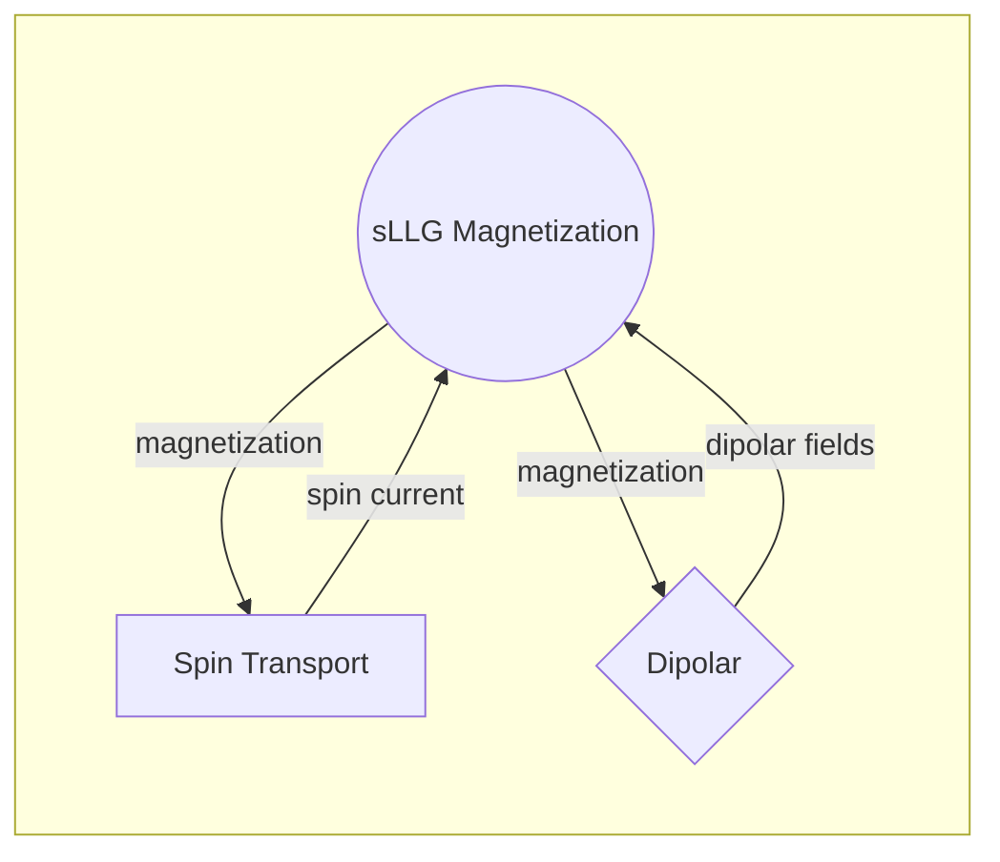

# p-bit design with stochastic MTJs 
This  _GitHub repository_  provides the spin-circuit that emulates probabilsitic bit (p-bit) build on 3-transistor 1-sMTJ topology. The stochastic MTJ (sMTJ) used in this design consists of the [proposed](https://journals.aps.org/prapplied/abstract/10.1103/PhysRevApplied.15.044049) double-free sMTJ, simulated for a 10 nm diameter in-plane-easy-axis circular magnet using comprehensive spin circuit model. The device model is then combined with advanced predictive technology models ([PTM](https://dl.acm.org/doi/10.1145/1229175.1229176)) for 14 nm FinFET transistors to achieve 3T/1M topology. 

See the link for the related paper, MTJ design with two synthetic antiferromagnetic layers (4 ferromagnets) using the same approach:  [https://arxiv.org/abs/2311.06642]

# Simulation Files

HSPICE files:
* ` main_PBIT_DFM.sp` : Main file for simulating the stochastic MTJ-based p-bit design using spin circuit modules.
* ` m_sLLG.sp`  - Defines the magnetism properties of the magnet using Landau-Lifshitz-Gilbert (LLG) equations.
* ` G_FMNM.sp`  - Spin transport model of the magnet utilizing interface dynamics between Ferromagnet and Normal metal.
* ` H_dipolar.sp`  - Models dipolar field interactions of the magnet, providing the magnetic fields.
* ` FETmodels.. `  - Contains model files for FinFET technology.

The flowchart of interacting spin circuit modules simulating a stochastic MTJ:

## Running the simulation
The netlist for simulating a single probabilistic bit is provided in HSPICE format.  
To execute the simulation, simply run the **main_PBIT_DFM.sp** file located in the `HSPICE` directory. Simulation results are stored in a **~.printtr0** extension file in column format, which includes the node measurements designated for output.

