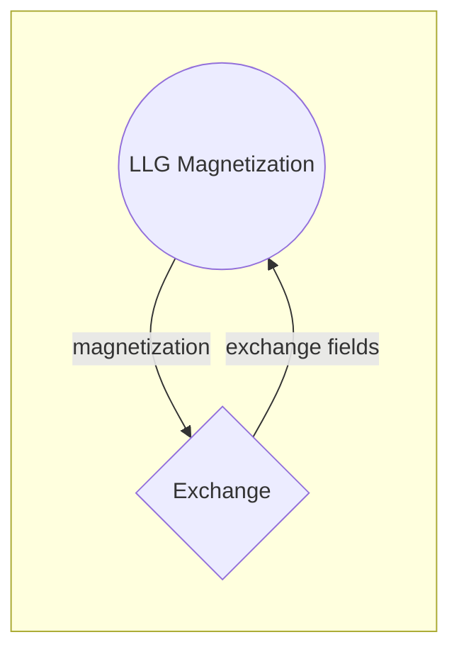

# Antiferromagnets with Spin-circuits

This  _GitHub repository_  provides the spin-circuit design that emulates natural antiferromagnetic resonance (AFMR) phenomena built and measured in SPICE with the spin-circuit architecture. AFMR phenomenon is one of the observable characteristics of the natural antiferromagnets, that investigates 2 AFM atomic sublattices collective oscillation behaviors under altering external magnetic field, leading to resonance. 

In this spin-circuit that describes AFMR device, each LLG module captures the magnetic behavior of a single sublattice, as a function of the magnetic field in between them and that is generated by the exchange block. This interaction among the sub-modules happens instantaneously so that magnetization information determines the corresponding exchange field and the exchange field that goes into LLG captures the magnetization of the sublattice in transient.

For more details and source codes, also visit:  [https://nanohub.org/groups/spintronics]

# Simulation Files

HSPICE files:
* ` mainAFMR.sp` : Main file for simulating the stochastic MTJ-based p-bit design using spin circuit modules.
* ` m_LLG.sp`  - Defines the magnetism properties of the magnet using Landau-Lifshitz-Gilbert (LLG) equations.
* ` H_exchange.sp`  - Models dipolar field interactions of the magnet, providing the magnetic fields.

The flowchart of interacting spin-circuit modules simulating a natural antiferromagnet:

## Running the simulation
The simulation region is divided into three parts because we need different measurements for each. This is because when we automatically find out the resonance frequency, a single magnetic field can have many resonance frequencies. So, we need to look at these magnetic fields one by one.

For the spin-flop measurements, we go up to magnetic fields over 900 Oe (or 9T when we adjust the scale). The measurements for low-angle resonances are done with weaker fields. SPICE does all the work of finding these measurements, so we don't have to guess or make decisions ourselves.

The netlist for simulating an antiferromagnet is provided in HSPICE format.  
To execute the simulation, simply run the **mainAFMR.sp** file located in the `HSPICE` directory. Simulation results will be stored in a **~.csv** extension file in column format, which includes the resonance frequency  measurements for swept AC frequencies.

